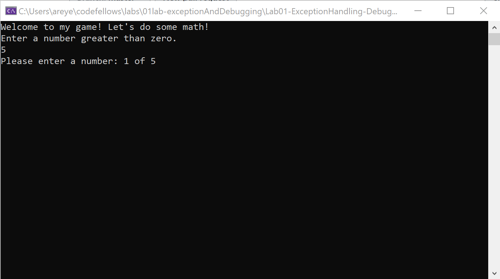
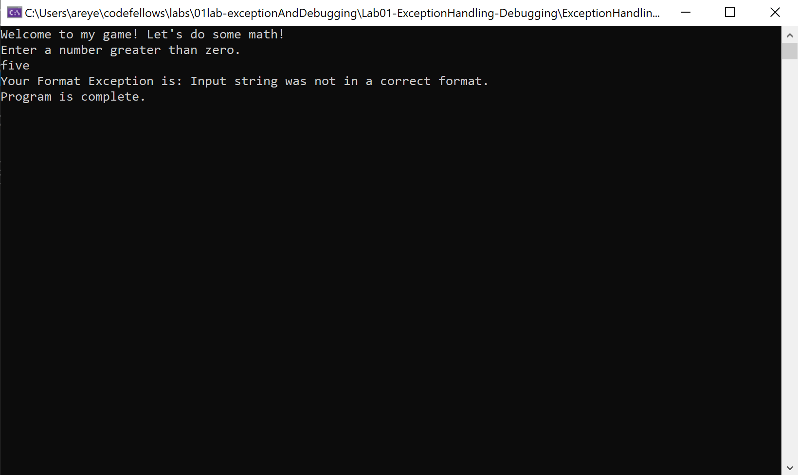
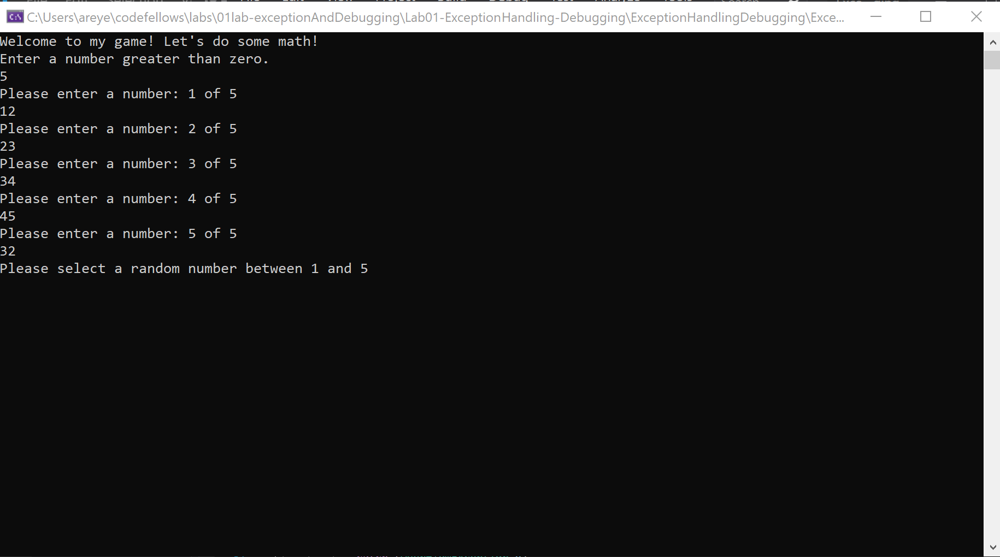
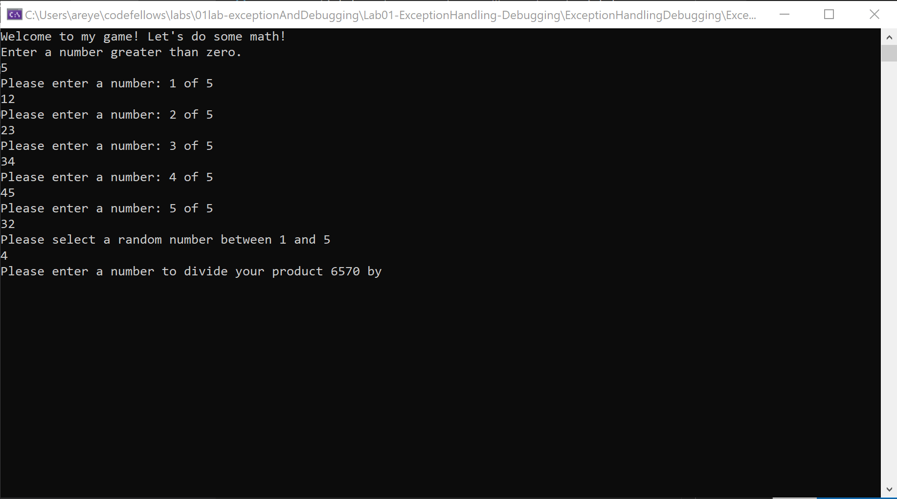
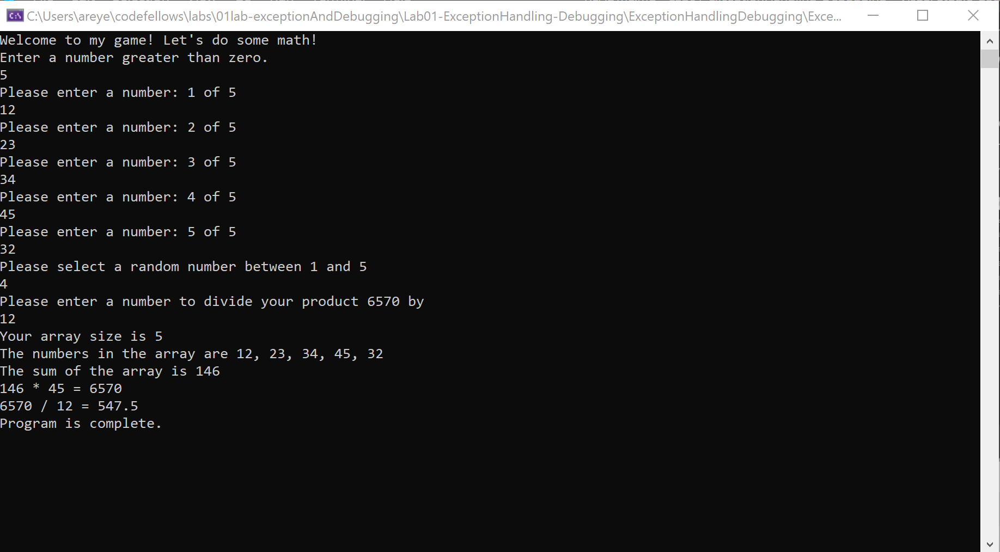

# Lab01-ExceptionHandling-Debugging

## Purpose
The application is a math game! User is prompted number values into the console and the console will show the outputs depending on the user's inputs.

## How to Run This App
1. Clone this application to your terminal into a folder of your choosing:  
`https://github.com/areyes986/Lab01-ExceptionHandling-Debugging.git`
2. Then inside your terminal, make sure you are inside the folder of the cloned repo and find `program.cs`. 
3. Enter `dotnet run`.

## How to Use App
1. This is what automatically populates right when the user enters the app. It prompts them to type in a number greater than zero.

When user enter their number, `Please enter a number` will be asked as many times as their inputted number. 

Error Example:  

If user enters an invalid response, the system outputs an error and kicks out of the program. In this case, this was a format error where user enters in a string and not the actual integer value.

2. After the system asks as many times as their inputted number, the console asks to choose a random number between 1 and their number.

3. After the user enters the number, multiples all the numbers together and asks the user to pick any number to divide the product by.

4. When user enters the number the console displays more information about the numbers they had entered as well as the divided number on the second to last line. After that, the program is complete!

